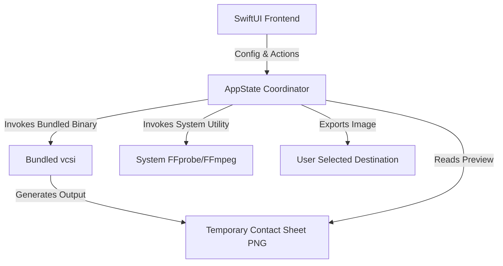

# Architecture - FrameSheet

## System Overview

FrameSheet follows a lightweight, single-binary Swift frontend model coordinating with local/bundled media utilities.



## Folder Structure & Components

```
FrameSheet
├── SwiftUI Frontend (main.swift)
│   ├── MainView (App Container & Drag-and-Drop)
│   ├── SidebarView (Control Panel)
│   │   ├── LayoutTab (Columns, Rows, Grid Spacing, Dual-linked Sizing)
│   │   ├── StyleTab (Colors, Fonts, Timestamps, Custom Headers)
│   │   └── FramesTab (Delayed limits, custom timestamp text)
│   ├── CanvasView (Zoomable Render Preview Area)
│   ├── TopBarView (Zoom Controls, Cancel / Generate Toggle)
│   └── ConsoleView (Process Output Stream Panel)
│
├── Services (AppState Coordinator Logic)
│   ├── VCSIService (Standalone vcsi Execution & Argument Construction)
│   ├── FFmpegService (FFprobe JSON Metadata Parser & Validation)
│   └── ExportService (Native Save Sheet & Output File Handler)
│
└── Resources
    └── bundled vcsi binary (FrameSheet.app/Contents/Resources/bin/vcsi)
```

### Component Details

#### 1. SwiftUI Frontend
- **MainView**: The core window coordinator. Manages file drop handlers (`onDragOver` / `performDrop`) and links state variables.
- **SidebarView**: Configures layout, style, and frames using a segmented picker interface.
- **CanvasView**: A dynamic, aspect-ratio-locked preview layer that renders generated contact sheets with mouse-wheel zoom capabilities.
- **TopBarView**: Provides responsive zoom triggers and unified `Generate/Cancel` functionality.
- **ConsoleView**: Outputs stdout/stderr streams from child processes to aid user troubleshooting.

#### 2. Services (Logical Architecture inside `AppState`)
- **VCSIService (`generateSheet`)**: Builds complex shell arguments (columns, rows, spacing, custom templates, timestamp position, custom fonts), spawns asynchronous `Process` runs, and streams logs to `ConsoleView`.
- **FFmpegService (`loadVideoMetadata`)**: Uses `ffprobe -v error -show_entries ... -of json` to extract stream duration, dimensions, and format details to generate accurate scale previews.
- **ExportService (`savePreviewImage`)**: Handles UI file export workflows using `NSSavePanel`, resolving dynamic naming patterns like `[filename]_sheet.png` and managing destination writes.

#### 3. Resources
- **vcsi binary**: Python execution is compiled into an executable using PyInstaller. Packaged under `bin/vcsi` within the app's Resources bundle to remove Python environment requirements for end users.
