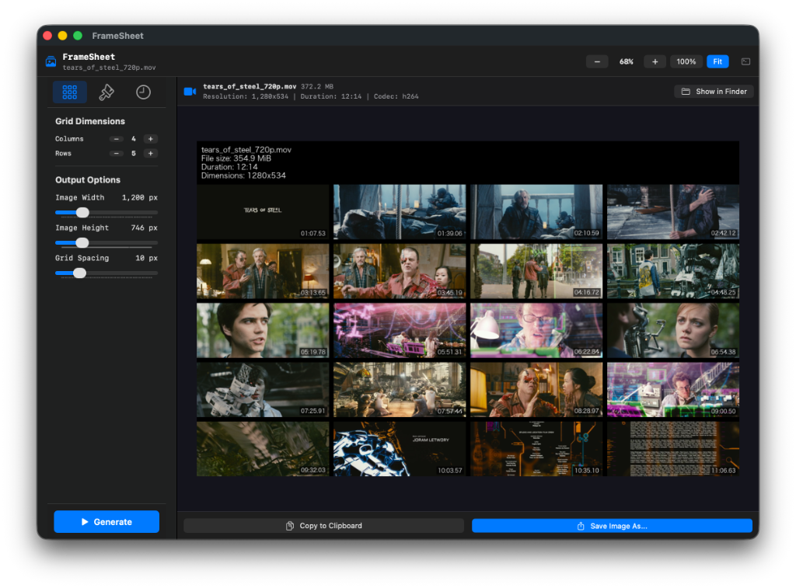

#  FrameSheet



FrameSheet is a macOS native app that generates customizable video contact sheets (MoviePrints).  
**v2** replaces the vcsi backend with a native ffmpeg single-pass engine + CoreGraphics compositor, delivering dramatically faster generation especially for HEVC/4K content.

## Features

- **SwiftUI Native Experience**: Sleek, responsive, and lightweight UI following modern macOS design.
- **Real-time Previews**: See grid size, spacing, font, and colors update on-the-fly.
- **Flexible Grid Controls**: Adjust columns, rows, spacing, and image width with quick `−` / `+` steppers.
- **Standard macOS Font Picker**: Choose any installed system font via macOS's native font panel.
- **Timestamp Overlays**: Uniform or custom timestamps drawn in four corner positions.
- **Custom Header Template**: Jinja2-style placeholders (`{{filename}}`, `{{duration}}`, etc.) resolved in Swift.
- **Built-in Console Logger**: Inspect raw ffmpeg output, copy or export log.

## Performance (v2 vs v1)

| Engine | 4K HEVC 4×4 grid |
|---|---|
| v1 — vcsi (per-frame random seek) | 1m 52s – 6m 42s |
| **v2 — ffmpeg single-pass** | **~2m 48s** (sequential decode, no seek overhead) |

The single-pass approach decodes the video linearly rather than seeking to each frame individually, which eliminates the keyframe-reload penalty that made HEVC extraction so slow in v1.

## Prerequisites

Only **FFmpeg** is required — no Python, no vcsi.

```bash
brew install ffmpeg
```

The app detects `ffmpeg` / `ffprobe` on launch and shows an overlay if they are missing.

## Building

```bash
./build.sh
```

The packaged application is generated at `./build/FrameSheet.app`.

## Author

Created and maintained by **kni**.

## License

This project is licensed under the MIT License - see the [LICENSE](LICENSE) file for details.
