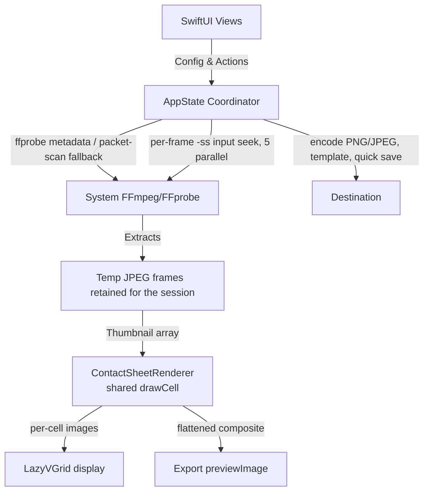

# Architecture - FrameSheet

## System Overview

FrameSheet is a single-binary Swift/SwiftUI app coordinating the system's `ffmpeg`/`ffprobe` with a native CoreGraphics compositor. There are no bundled binaries or Python dependencies (since v2.0.0), and no Xcode project — `build.sh` compiles everything under `src/` with `swiftc -parse-as-library`.



## Source Layout (`src/`)

```
src/
├── FrameSheetApp.swift        @main entry; WindowGroup; ⌘O command
├── AppDelegate.swift          Finder/Dock open-event routing
├── Models.swift               VideoFileInfo, FFProbeResult
├── Thumbnail.swift            One grid cell: id, timestamp, imagePath, hidden
├── AppState.swift             ObservableObject: all @Published state
├── AppState+Dependencies.swift  ffmpeg/ffprobe discovery & launch check
├── AppState+Loading.swift     loadVideo (ffprobe JSON), duration estimation
├── AppState+Generation.swift  sampling math, 5-way parallel extraction,
│                              renderAndPresent (sheet + cell images)
├── AppState+Grid.swift        Phase 3a: hide/unhide, re-flow recompose,
│                              per-cell nudge, keyboard selection & shortcuts
├── AppState+Export.swift      filename templating, PNG/JPEG encode,
│                              save panel / quick save, individual frames
├── AppState+Persistence.swift UserDefaults round-trip for settings
├── AppState+Sizing.swift      width/height solving, fit-to-screen zoom
├── ContactSheetRenderer.swift metrics, drawCell, full-sheet render,
│                              per-cell render, header strip, reflowParams
├── Extensions.swift           Color.toHex, NSImage.pixelSize, monoFont
├── FontPanelBridge.swift      NSFontPanel bridge for custom fonts
├── assets/AppIcon.png         build resource (build.sh → .icns)
└── Views/
    ├── MainView.swift         window layout; installs the key monitor
    ├── TopBarView.swift       zoom controls, console toggle
    ├── SidebarView.swift      single scrolling settings column +
    │                          pinned Generate/Cancel
    ├── CanvasView.swift       video info bar, grid/preview display,
    │                          drag & drop, export action bar
    ├── ThumbnailGridView.swift  LazyVGrid + header strip; drag-reorder
    ├── ThumbnailCellView.swift  one cell: hover overlay (timestamp,
    │                          hide, nudge), selection ring
    ├── ConsoleView.swift      collapsible log panel
    ├── Tabs/                  sidebar sections (LayoutTab, StyleTab,
    │                          FramesTab, OutputSection, ColorPresetSelector)
    └── Components/            DependencyRow, CheckerboardBackground
```

## Core Model

### State: one `AppState`, split by concern

All app state lives in a single `ObservableObject` (`AppState`), shared by every window. Its behavior is split across extension files by concern (see layout above) rather than separate service classes — the Phase 1 refactor (see `docs/DECISIONS.md` #5) chose per-concern extensions over introducing an abstraction layer. Generation settings persist via `UserDefaults` (`AppState+Persistence.swift`); transient state (zoom, console, selection, hidden flags) does not.

### Generation pipeline

1. `loadVideo(url:)` probes metadata with `ffprobe` (JSON). If duration is missing/`N/A`/0, `estimateDuration` falls back to a demux-only packet-timestamp scan (two attempts; cancellable) before generating.
2. `generateContactSheet()` computes sampling timestamps (grid size × start/end delay, or custom timestamps), then `runParallelFrameExtraction()` runs **one input-seeking ffmpeg invocation per frame** (`-ss <t> -i <file> -frames:v 1`, software decode, JPEG `-q:v 3`), 5 concurrent, into a per-generation temp dir.
3. The temp frames dir is **retained** for the session (replaced on the next generation) so per-thumbnail features can re-read and re-extract individual frames.
4. `renderAndPresent` composites the export image and renders the per-cell display images in the same pass, then publishes atomically with a `generationID` guard against superseded runs.

### Display vs. export (Phase 3a)

The preview is an addressable grid, not a flattened bitmap:

- `thumbnails: [Thumbnail]` is the single source of grid order and per-cell state (timestamp, backing frame path, hidden flag).
- **Display path**: `ThumbnailGridView` lays out one `ThumbnailCellView` per element with `ContactSheetRenderer.metrics` geometry, using pre-rendered per-cell images (`cellImages[id]`) and a header strip. It reads a `displayParams` snapshot captured at render time, so in-flight settings changes cannot shear the layout before regeneration lands.
- **Export path**: `ContactSheetRenderer.render` flattens the same array into one image (`previewImage`), which Copy/Save/Quick-Save consume.
- Both paths draw cells through the same `drawCell` function — the single source of truth that keeps on-screen cells and exported cells pixel-identical.

### Per-thumbnail interactions (`AppState+Grid.swift`)

- **Hide**: toggles `Thumbnail.hidden`; the grid dims the cell in place, while the export recomposes with visible cells compacted in raster order and rows re-flowed to `ceil(visible/cols)` (`reflowParams`; decision #8). Hidden state resets on regeneration.
- **Reorder**: drag & drop (`onDrag`/`onDrop` + `DropDelegate`; deployment target macOS 11 predates `.draggable`) live-moves elements of `thumbnails`; the sheet recomposes on drop.
- **Nudge**: shifts one cell's timestamp by the configured step and re-extracts *only that frame* with a single ffmpeg invocation into the retained frames dir, then re-renders that cell and recomposes.
- **Keyboard**: an `NSEvent` local monitor (macOS 11-compatible) provides click-to-select with a focus ring, arrow navigation over all displayed cells (including dimmed hidden ones — decision #9), Space/Delete hide, `,`/`.` nudge, and Esc to clear. Events pass through while a text field is being edited or command/control/option is held.

### Export (`AppState+Export.swift`)

Filename templating (`{{filename}}`, `{{width}}`, `{{height}}`, `{{columns}}`, `{{rows}}`, `{{date}}`), PNG/JPEG encoding (JPEG quality slider; translucent backgrounds composite over the opaque background color behind an inline warning — decision #7), quick save next to the source video with `_2`/`_3` auto-suffixing, and optional per-frame export of visible thumbnails into a `<name>_frames/` subfolder.

## Superseded designs

Kept for historical context; details in `docs/DECISIONS.md` and `docs/DEV_LOG.md`:

- **Monolithic `main.swift`** (through v2.0.x): all state, views, and rendering in one file at the repo root — superseded by the Phase 1 split and later the `src/` move.
- **Tabbed sidebar** (Layout/Style/Frames segmented tabs): superseded by the MoviePrint-style single scrolling settings column (Phase 1 Stage B).
- **`vcsi`/Python engine** (pre-v2.0.0) and **Fast Mode keyframe previews** (removed in Phase 3, 2026-07-07): superseded by the parallel per-frame input-seek engine, which is fast enough to be the only path.

## Dependencies

No bundled binaries. `ffmpeg`/`ffprobe` are resolved from common install prefixes and PATH at launch; a blocking overlay with re-check guides installation when missing.
