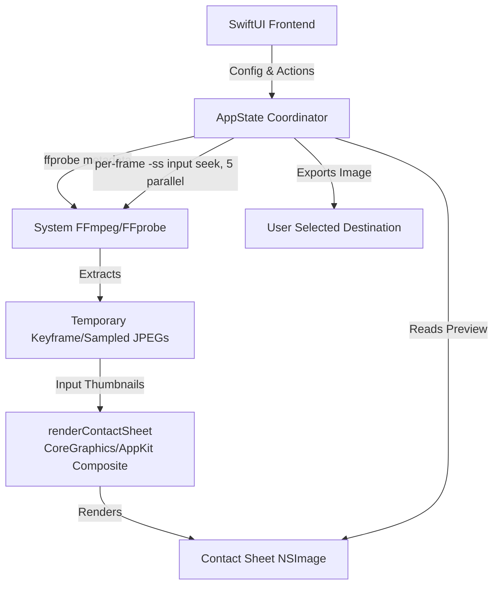

# Architecture - FrameSheet

## System Overview

FrameSheet follows a lightweight, single-binary Swift frontend model coordinating with the system's `ffmpeg`/`ffprobe` and a native CoreGraphics compositor. As of v2.0.0, there are no bundled binaries or Python dependencies.



## Folder Structure & Components

```
FrameSheet
├── SwiftUI Frontend (main.swift)
│   ├── MainView (App Container & Drag-and-Drop)
│   ├── SidebarView (Control Panel)
│   │   ├── LayoutTab (Columns, Rows, Grid Spacing)
│   │   ├── StyleTab (Colors, Fonts, Timestamps, Custom Headers)
│   │   └── FramesTab (Auto Sampling Range: Start/End Delay, custom timestamp text)
│   ├── CanvasView (Zoomable Render Preview Area)
│   ├── TopBarView (Zoom Controls, Cancel / Generate Toggle)
│   └── ConsoleView (Process Output Stream Panel)
│
├── Services (AppState Coordinator Logic)
│   ├── FFmpegEngine (`generateContactSheet` / `runParallelFrameExtraction`):
│   │     Runs one input-seeking ffmpeg invocation per frame (`-ss <t>
│   │     -i <file> -frames:v 1`, software decode) with 5 concurrent
│   │     processes, writing temporary JPEG thumbnails (`-q:v 3`) and
│   │     logging to `ConsoleView`.
│   ├── ContactSheetRenderer (`renderContactSheet`): Composites the extracted
│   │     JPEG thumbnails into the final image using CoreGraphics/AppKit
│   │     (`NSAttributedString` for header/timestamp text).
│   ├── FFmpegService (`loadVideoMetadata`): Uses `ffprobe -v error
│   │     -show_entries ... -of json` to extract stream duration, dimensions,
│   │     and format details to generate accurate scale previews.
│   └── ExportService (`savePreviewImage`): Handles UI file export workflows
│         using `NSSavePanel`, resolving dynamic naming patterns like
│         `[filename]_sheet.png` and managing destination writes.
│
└── Resources
    └── (none bundled — ffmpeg/ffprobe are resolved from the system PATH)
```

### Component Details

#### 1. SwiftUI Frontend
- **MainView**: The core window coordinator. Manages file drop handlers (`onDragOver` / `performDrop`) and links state variables.
- **SidebarView**: Configures layout, style, and frames using a segmented picker interface.
- **CanvasView**: A dynamic, aspect-ratio-locked preview layer that renders generated contact sheets with mouse-wheel zoom capabilities.
- **TopBarView**: Provides responsive zoom triggers and unified `Generate/Cancel` functionality.
- **ConsoleView**: Outputs stdout/stderr streams from the ffmpeg child process to aid user troubleshooting.

#### 2. Services (Logical Architecture inside `AppState`)
- **FFmpegEngine (`generateContactSheet` / `runParallelFrameExtraction`)**: Computes sampling parameters (columns, rows, spacing, start/end delay, custom timestamps) and extracts one frame per timestamp with an input-seeking invocation (`ffmpeg -ss <t> -i <file> -frames:v 1`, software decode — GOP-sized work where hwaccel init would dominate), run 5-concurrent with cancellation support, writing JPEG (`-q:v 3`) temporaries and logging to `ConsoleView`. (Phase 2 replaced the previous `fps=1/interval` full-range decode: 60-min H.264 benchmark ~220 s → ~1 s. Phase 3 removed the keyframe-only Fast Mode entirely — no longer needed at these speeds, and it hung on WebM sources lacking cues.)
- **ContactSheetRenderer (`renderContactSheet`)**: Composites the extracted JPEG thumbnails and overlays (header, timestamps) into the final `NSImage` using CoreGraphics bitmap contexts and `NSAttributedString`.
- **FFmpegService (`loadVideoMetadata`)**: Uses `ffprobe -v error -show_entries ... -of json` to extract stream duration, dimensions, and format details to generate accurate scale previews.
- **ExportService (`savePreviewImage`)**: Handles UI file export workflows using `NSSavePanel`, resolving dynamic naming patterns like `[filename]_sheet.png` and managing destination writes.

#### 3. Resources
- No bundled binaries. `ffmpeg`/`ffprobe` are resolved from the system PATH (e.g. Homebrew install) and checked on launch via the dependency overlay.
